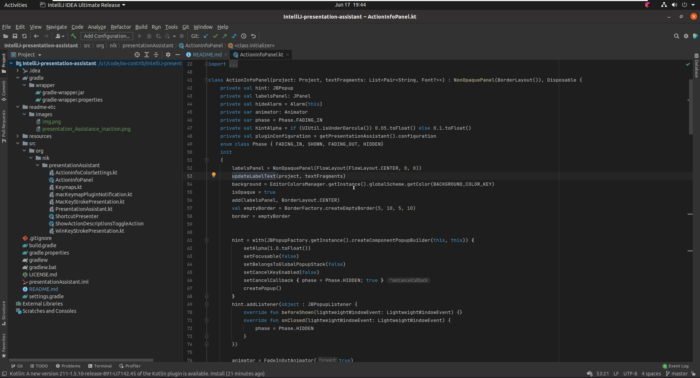
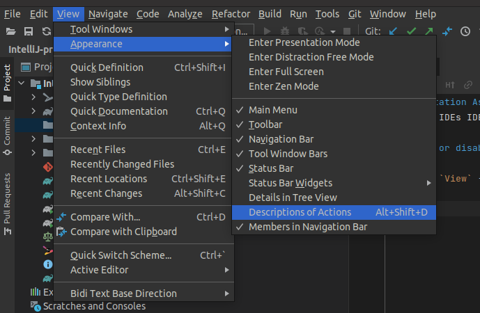

# Presentation Assistant

An IntelliJ plugin that provides caption for key press events.
(**Refer**: http://plugins.jetbrains.com/plugin/7345).

**Tip:** Install `macOS Keymap` plugin to show Mac Shortcuts on Windows/Linux machine.

# Enable or Disable Presentation Assistant

In Menu, `View` -> `Appearance` -> toggle `Descriptions of Actions Alt+Shift+D`

# Keyboard Shortcut

Windows/Linux: `Alt` + `Shift` + `D`

MacOS:  `⌥ Option` + `⇧ Shift` + `D`

